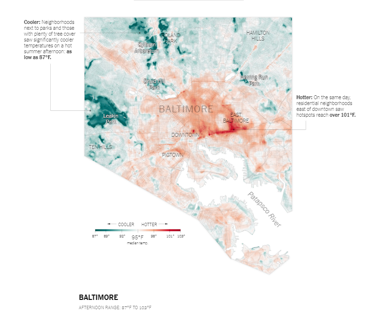
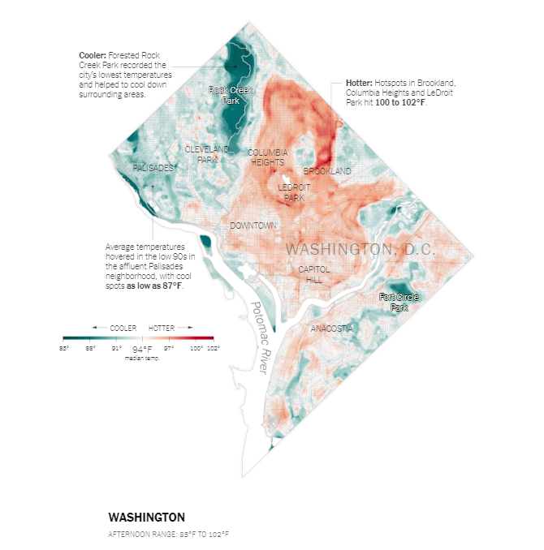
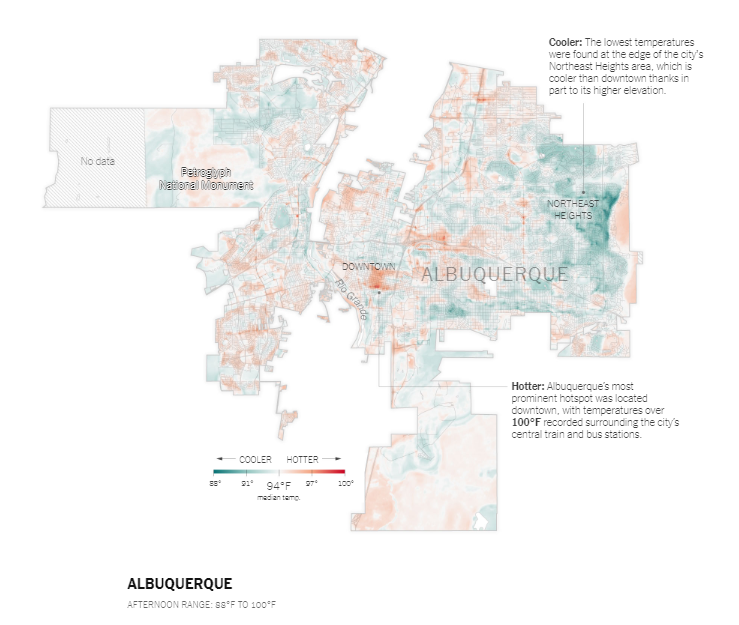
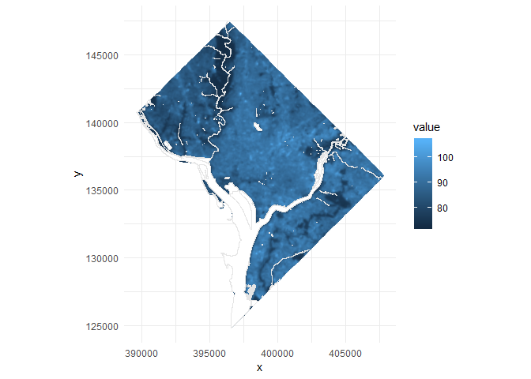

One of my favorite strategies for learning more about data visualization is to try to recreate other work. This is especially true for maps! I recently came across a New York Times article called [Summer in the City Is Hot, but Some Neighborhoods Suffer More](https://www.nytimes.com/interactive/2019/08/09/climate/city-heat-islands.html) by Nadja Popovich and Christopher Flavelle. It talks about how urban areas are hotter than non-urban areas on average, but within urban areas there can be a lot of variation. For example areas near parks and water are cooler and industrial parks are hotter.

The article had a lot of really great information, but the most striking thing to me was the maps. They mapped a few different urban areas in the US, including Baltimore, DC, and Albuquerque. I'd encourage you to read it!

<br>



------------------------------------------------------------------------

<br>



------------------------------------------------------------------------

<br>



<br>

Landsat (raster) temperature data for DC was the [easiest to find](https://opendata.dc.gov/search?q=temperature) on the city's open data portal, so that was the map I decided to make. I also wanted to make it completely in R, or as much as I reasonably could. I chose the [July 2018](https://drive.google.com/file/d/1z8Zv-EdMWWjhNK8ZNf0X7I1pR9GrT7F5/view) data, but you could chose from any of the available files and use the same code for the map. It would also be interesting to compare patterns over time!

``` r
library(raster) # reading in and wrangling landsat data
library(sf) # reading in and wrangling contextual data
library(tidyverse)
# devtools::install_github("clauswilke/ggtext")
library(ggtext) # text in plots
library(showtext) # more fonts
font_add_google("Lato", regular.wt = 300, bold.wt = 700) # I like using Lato for data viz (and everything else...). Open sans is also great for web viewing.
```

To make the maps, I started by using base R plotting but eventually moved to **ggplot2**, mostly for easier text integration.

``` r
landsat_dc_july18 <- raster("data/LST_F_20180708.tif") # saved the downloaded files in a data/ folder

# water features in the city
water <- st_read("https://opendata.arcgis.com/datasets/db65ff0038ed4270acb1435d931201cf_24.geojson") %>%
  st_transform(st_crs(landsat_dc_july18)) # use the same coordinate reference system as the landsat data
```

Then we can get a nice summary of the landsat data just with **raster** functions.

``` r
landsat_dc_july18 # gives info like extent, crs, min/max
```

    ## class      : RasterLayer 
    ## dimensions : 768, 623, 478464  (nrow, ncol, ncell)
    ## resolution : 30, 30  (x, y)
    ## extent     : 389448.6, 408138.6, 124698.5, 147738.5  (xmin, xmax, ymin, ymax)
    ## crs        : +proj=lcc +lat_1=39.45 +lat_2=38.3 +lat_0=37.66666666666666 +lon_0=-77 +x_0=400000 +y_0=0 +datum=NAD83 +units=m +no_defs +ellps=GRS80 +towgs84=0,0,0 
    ## source     : C:/Users/JollyKD/Documents/nyt-heat-maps/data/LST_F_20180708.tif 
    ## names      : LST_F_20180708 
    ## values     : 72.48885, 106.6179  (min, max)

``` r
summary(landsat_dc_july18) # gives distribution summary based on a sample
```

    ##         LST_F_20180708
    ## Min.          72.48885
    ## 1st Qu.       82.27658
    ## Median        88.08034
    ## 3rd Qu.       91.35205
    ## Max.         104.63557
    ## NA's           0.00000

From this we can see that the temperature ranges from 72 to 106 F with a median of 88 F and there are no NAs.

To plot this data with **ggplot2** I first converted the raster values to a dataframe in two steps.

``` r
temp_spdf <- as(landsat_dc_july18, "SpatialPointsDataFrame") # create spatialpoints dataframe
temp_df <- as_tibble(temp_spdf) # convert that to a plain tibble
colnames(temp_df) <- c("value", "x", "y") 
```

Then I also converted the water data to an **sp** object in order to use the `coord_equal()` function in **ggplot2**, more on that later.

``` r
water_sp <- as(water, "Spatial")
```

At this point we can make a "minimum viable product" map.

``` r
ggplot() +
  geom_raster(data = temp_df, aes(x = x, y = y,  fill = value), interpolate = TRUE) +
  geom_polygon(data = water_sp, aes(x = long, y = lat, group = group), color = "gray90", fill = "white") +
  coord_equal() + # make sure that the x and y axis are comparable
  theme_minimal()
```



It's hard to see the patterns with this color scheme, though. I want to use a [diverging color scheme](https://blog.datawrapper.de/colors/) to highlight low and high values. I started with generating color schemes using the [Chroma.js Color Palette Helper](https://gka.github.io/palettes/#/9%7Cd%7C00429d,96ffea,ffffe0%7Cffffe0,ff005e,93003a%7C1%7C1) but I ended up using the R package [rcartocolor](https://github.com/Nowosad/rcartocolor) which integrates the [Carto color schemes](https://carto.com/carto-colors/).
